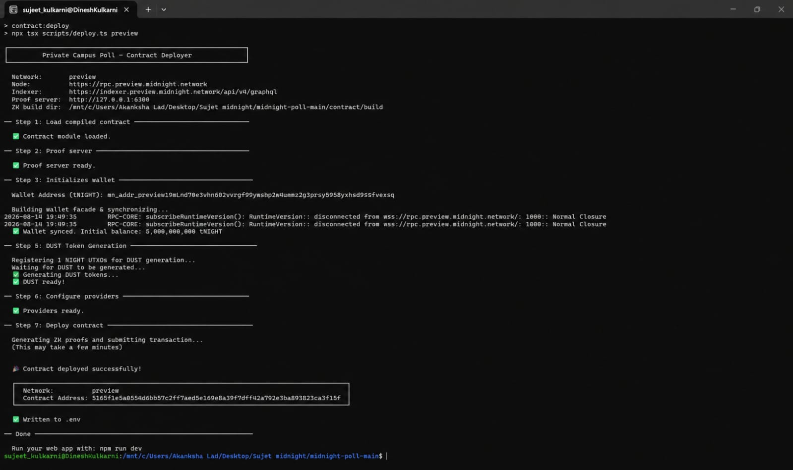

# Midnight Smart Contract Deployment Steps

This document outlines the step-by-step procedure for deploying the **Private Campus Poll** smart contract on the **Midnight Network (Preview Testnet)**.

---

## 1. Deployment Summary

- **Network:** Midnight Preview Network
- **Contract Name:** `private-campus-poll`
- **Contract Address:** `5165f1e5a05546bb57c2ff7aed5e169e8a39f7dff42a792e3ba893823ca5f15f`
- **Deployment Transaction Hash:** `c602161f626289cec1ae4e7efc4b8a71e970c816822b17ee55b3e82d0f8ba39e`
- **Deployment Block Height:** `420139`
- **Deployment Status:** ✅ Successfully Deployed & Indexed On-Chain

---

## 2. Prerequisites

1. **Node.js**: Ensure Node.js (v20+ or v22+) is installed.
2. **Compact Compiler**: Install the official Midnight Compact compiler:
   ```bash
   curl --proto '=https' --tlsv1.2 -LsSf https://github.com/midnightntwrk/compact/releases/latest/download/compact-installer.sh | sh
   compact update
   export PATH="$HOME/.compact/bin:$PATH"
   ```
3. **Proof Server**: Either use local Docker proof server or remote proof server endpoint:
   ```bash
   docker run -p 6300:6300 midnightnetwork/proof-server:latest -- 'midnight-proof-server --network undeployed'
   ```
4. **Midnight Faucet**: Obtain test tokens (tNIGHT & tDUST) from [https://faucet.preview.midnight.network](https://faucet.preview.midnight.network).

---

## 3. Step-by-Step Deployment Guide

### Step 1: Clone Repository & Install Dependencies

```bash
cd midnight-poll-main
npm install
```

### Step 2: Configure Environment Variables

Create or verify the `.env` file in the root directory:

```env
# Network ID
VITE_MIDNIGHT_NETWORK_ID="preview"

# Deployed Contract Address
VITE_POLL_CONTRACT_ADDRESS="5165f1e5a05546bb57c2ff7aed5e169e8a39f7dff42a792e3ba893823ca5f15f"

# Midnight Preview Network Endpoints
VITE_INDEXER_URI="https://indexer.preview.midnight.network/api/v4/graphql"
VITE_INDEXER_WS_URI="wss://indexer.preview.midnight.network/api/v4/graphql/ws"
VITE_NODE_URI="https://rpc.preview.midnight.network"
VITE_PROOF_SERVER_URI="https://proof-server.preview.midnight.network"

# Deployer Wallet Seed (BIP-39 mnemonic)
MIDNIGHT_WALLET_SEED="shuffle crunch verify barely pave fine gallery weasel comic fabric steel believe debris false alone rural pudding boost guide segment notice deposit nuclear donkey"
```

### Step 3: Compile Smart Contract & Generate ZK Artifacts

Compile the Compact contract circuits and generate proving & verifying keys:

```bash
npm run contract:build:zk
```

This outputs the compiled artifacts in `contract/managed/private-campus-poll/` including:

- `contract/index.cjs` & `contract/index.d.ts`
- `keys/createPoll.prover`, `keys/vote.prover`, `keys/closePoll.prover`
- `zkir/createPoll.zkir`, `zkir/vote.zkir`, `zkir/closePoll.zkir`

### Step 4: Execute Contract Deployment

Run the automated deployment script:

```bash
npm run contract:deploy
```

**Execution Flow:**

1. Resolves and derives shielded, unshielded, and DUST wallet keys directly from the constant deployer wallet.
2. Synchronizes wallet state with the Midnight ledger indexer.
3. Automatically creates DUST registration recipe if needed.
4. Generates zero-knowledge proofs for contract constructor via Proof Server.
5. Builds and balances the unbound deployment transaction.
6. Submits the deployment transaction to the Midnight node RPC.
7. Polls GraphQL indexer until the contract state is confirmed on-chain.
8. Writes the new contract address to `.env` under `VITE_POLL_CONTRACT_ADDRESS`.

---

## 4. Verification & Testing

Verify that the contract is live on-chain and unit tests pass:

```bash
npm test
```

And start the development frontend:

```bash
npm run dev
```

---

## 5. Deployment Proof


